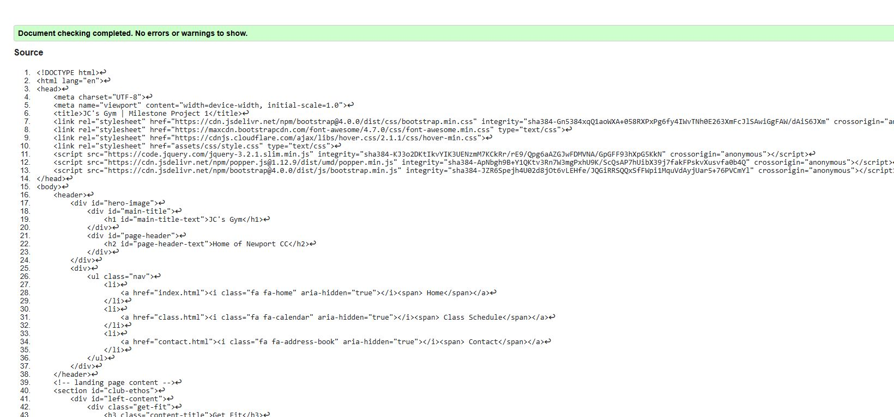
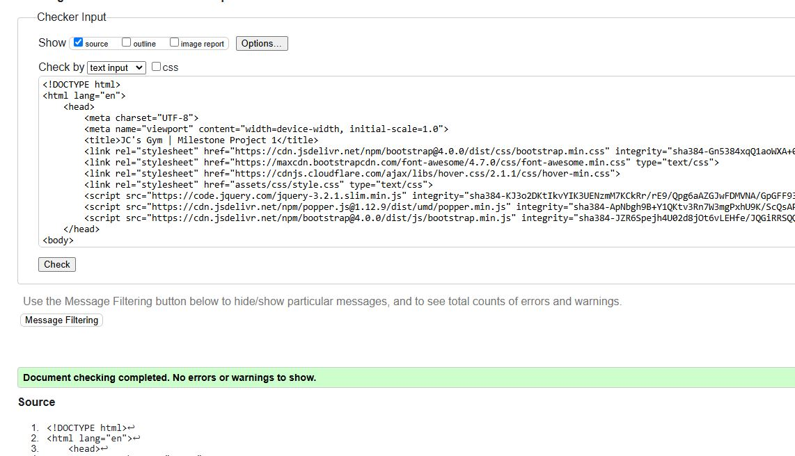

# Mile Stone Project 1 - JC's Gym

For my Milestone Project 1 I have decided to create a three page, front end site for a fictitious Gym that has affiliations with the local Cricket team.

JC's Gym is a located in a rural village in East Riding of Yorkshire on the same premises os the local village Cricket team.  It provides members with fitness classes and access to gym equipment.

The purpose of the site is to attract new members to sign up to the Gym classes or show interest in joining the cricket team.

[Visit deployed website](https://johnnycockerill.github.io/milestone_project_1/)

## Table of Contents
1. [User Experience (UX)](#user-experience-ux)
    1. [Project Goals](#project-goals)
    2. [User Stories](#user-stories)
    3. [Color Scheme](#color-scheme)
    4. [Typography](#typography)
    5. [Wireframes](#wireframes)
2. [Features](#features)
    1. [General](#general)
    2. [Landing Page](#landing-page)
    3. [Class Page](#class-page)
    4. [Contact Page](#contact-page)
    5. [Not Implemented](#features-left-to-be-implemted-in-future-releases)
3. [Technologies Used](#technologies-used)
    1. [Languages Used](#languages-used)
    2. [Frameworks, Libraries and Programs Used](#frameworks-libraries-and-programs-used)
4. [Testing](#testing)
    1. [Testing User Stories](#testing-user-stories)
    2. [Code Validation](#code-validation)
    3. [Accessibility](#accessibility)
    4. [Tools Testing](#tools-testing)
    5. [Manual Testing](#manual-testing)
5. [Finished Product](#finished-product)
6. [Deployment](#deployment)
    - [Github Pages](#github-pages)
7. [Credits](#credits)
    1. [Content](#content)
    2. [Media](#media)
    3. [Code](#code)
8. [Acknowledgements](#acknowledgements)

***

## User Experience (UX)

### Project Goals

- The website should have a calm, friemdly feel to design.

- The range of fitness classes should be clear and easily accessible.

- Provide information that can lead to future involvement with the gym or cricket team.

### User Stories

- As a customer, I want to be able to navigate the website intuitively and learn more about the gym and cricket team.

- As a customer, I want to be able to browse the schedule of bookable fitness classes.

- As a customer, I want to be able to register my interest with the local cricket team.

- As a customer, I want to be able to register interest for my child with the local junior team setup.

- As a customer, I want to find social media links to the business.

- As a customer, I want to easily find the contact information for the gym/team.

### Color Scheme

!needs finishing!

The colors used in the site reflect the teams logo of maroon (rgb(104, 10, 49)) and yellow (rgb(247, 211, 51)), these have been used for content titles and borders.

### Typography

The main font used in the site is Roboto, with Exo as the fallback font in case Roboto is not being imported correctly.

### Wireframes

  
Expand Index Page Wireframe

  

  
Expand Class Page Wireframe

  

  
Expand Contact Page Wireframe

  

## Features

### General

- Responsive design across all device sizes.
- Consistent colour scheme and design across all pages to enhance the user's navigation through the content.

#### Header

- The header contains the business name in the colour scheme of the team and a fully responsive navigation bar positioned below the hero image.

- The header contains the page title in the consistent colour scheme and style to provide familiarity across all pages.

- The navigation bar is identical in all pages and contains links to all pages to facilitate navigation across the site. It includes also an active hover effect to provide feedback to the customer for a better user experience.

- The business name and page title will adjust in size and scale across screen sizes.

#### Footer

- The footer includes links to social sites, facebook, instagram etc.  Also has links to teams league page, direct link to map location, landing and contact page.
- The footer is positioned at the bottom of the page and is always visible to aid immediate navigation.

### Landing Page

#### Welcome Image and Text

- The Welcome main image is designed to attract the customer attention with a motivational feel, however not being too dominating and still allowing for a relaxed feel. The message is particularly aimed at attracting new customers looking for a relaxed village gym.
- A direct link to the schedule page is immediately provided below the welcome image, to allow returning customers to easily access the range of classes provided.

#### Main Content

- The main content is split into two parts.
    - Firstly a section briefly describing the benefits for fitness and being healthy supported by a motivational image.
    - Second section is aimed at inspiring new customers to get involved, in the gym, classes or training with the team.  Supported by an image.

#### Image Carousel

- Positioned below the main content is an image carousel of the team's players, aiming to provide familiarity between the team and customers looking to train with the team.

#### Map Location

- Positioned at the bottom of the page is a live Google maps link showing the location of the premises.
- This section of the page has a direct link present in the footer of every page.

### Class Schedule Page

#### Welcome Image

- The welcome image is the same as the other pages to aid familiarity with the user, only the page title changes however retains the same colour scheme and style.

#### Class Schedule

- The main section of this page contains a table and simple form.
    - The table shows the days, times and types of different available fitness classes.
    - The user can select any number of classes, all classes are labelled and colour coordinated.
    - The form requires the customer to input name and email to book chosen classes.
    - On screen sizes below 480px the text appears as shorthand with a legend to further clarify the classes depited within the table.

### Contact Page

#### Welcome Image

- The welcome image is the same as the other pages to aid familiarity with the user, only the page title changes however retains the same colour scheme and style.

#### Main Content

- The content for the contact page is plit into three sections.
    - First section gives the user the opportunity to register interest in the team by completing a simple form.  The form is supported by an image of the playing field.
    - Second section gives the user the opportunity to register interest in the team on behalf of a minor by completing a form.  Supporeted by a video of training.
    - Third section presents the user with some direct contact information for the team chairman and captain.  Supported by images of the individuals to aid familiarity.

### Features left to be implemented in future releases

- Add animations to the welcome image.
- The ability to pay for classes or a gym membership.
    - This could extend to the ability to log into the site as a paid member.
- A link to the team shop, or the option to buy team merchandise directly from the site.

### Technologies Used

* [HTML5](https://en.wikipedia.org/wiki/HTML5)
* [CSS3](https://en.wikipedia.org/wiki/CSS)

### Frameworks, Libraries and Programs Used

* [Google Fonts](https://fonts.googleapis.com/)
    - Google Fonts was used to import the font Roboto and Exo into the style.css file. This font was used throughout the site.

* [GitPod](https://gitpod.io/)
     - GitPod was used for writing code, committing, and then pushing to GitHub.

* [GitHub](https://github.com/)
     - GitHub was used to store the project after pushing.

* [W3C Markup Validator](https://validator.w3.org/)
    - W3C Markup Validator was used to validate the HTML code.

* [W3C CSS Validator](https://jigsaw.w3.org/css-validator/)
    - W3C CSS Validator was used to validate the CSS code.

* [Bootstrap Library](https://getbootstrap.com/docs/4.0/components/carousel/)
    - Bootstrap was used for the image carousel.

## Testing

### Testing User Stories

- As a customer, I want to be able to navigate the website intuitively and learn more about the gym and cricket team.
    - The website has an intuitive, consistent structure and design allowing for easy navigation.
    - The nav and footer bar are present and consistent across all pages allowing for quick and simple navigation to key areas of the site.

- As a customer, I want to be able to browse the schedule of bookable fitness classes.
    - The class schedule page has a direct link from the nav bar.
    - The class schedule page has a clear and colour coordinated format allowing for easily understood information.

- As a customer, I want to be able to register my interest with the local cricket team.
    - There is a direct link within the nav bar and footer to the contact page.
    - Within the contact screen there is a simple form to send your details to the team.

- As a customer, I want to be able to register interest for my child with the local junior team setup.
    - There is a direct link within the nav bar and footer to the contact page.
    - Within the contact screen there is a simple form to send your details to the team.

- As a customer, I want to find social media links to the business.
    - Social media links are present within the footer on every page.

- As a customer, I want to easily find the contact information for the gym/team.
    - Direct contact information can be found on the contact page.
    - Location of the premises can be found on the landing page.
    - A direct link to both the conatct page and the location is always present within the footer.

### Code Validation

- W3 Validator has highlighted some HTML bugs:

  
Expand W3 Index Validation

  

  
Expand W3 Class Validation

  

  
Expand W3 Contact Validation

  

 

- W3C Validator shows zero errors with CSS:

  
Expand W3C CSS Validation

  

### Accessibility

* Used Lighthouse in Chrome DevTools to confirm that the colors and fonts being used in throughout the website are easy to read and accessible.

  
Expand Lighthouse Report Desktop

  

  
Expand Lighthouse Report Mobile

  

### Tools Testing

* Responsiveness

    - [Responsive Design Checker](https://www.responsivedesignchecker.com/) was used to check responsiveness of the site pages on different screen sizes.
    
    - Chrome DevTools was used to test responsiveness in different screen sizes during the development process.

### Manual Testing

* Common Elements Testing

    - All Pages
        - **Navigation Bar**
            - Hovering the cursor over nav bar link prompts active effect.
            - Clicking on the navigation bar's links will bring the customer to the specified page.
        
        - **Footer**
            - Hovering the cursor over nav bar link prompts active effect.
            - Clicking on the social media links will open the specific website on a new tab.

    - Index Page

        - Image carousel works without input.
        - clicking on map, opens live Google maps onto correct location.

    - Class Schedule Page

        - Clicking classes ticks the box corresponding to that choice.
        - Form input requires all fields to have content.

    - Contact Page

        - Both form inputs require all fields to be populated.
        - The e-mail input field requires the correct e-mail format.

## Finished Product

## Deployment

* This website was developed using [GitPod](https://www.gitpod.io/), which was then committed and pushed to GitHub using the GitPod terminal.

### GitHub Pages

* Here are the steps to deploy this website to GitHub Pages from its GitHub repository:

    1. Log in to GitHub and locate the [GitHub Repository](https://github.com/).
    2. At the top of the Repository, locate the Settings tab on the menu.
    3. Scroll down the Settings page until you locate the Pages section.
    4. Under Build and deployment, select "Deploy from a Branch" from the Source dropdown list.
    5. Under Branch, select Main and /Root from the relevant dropdown lists, then click Save.

## Credits

### Content

- Content is either my own fictional work or courtesy of Newport CC.

### Media

* [Hero Image - Aberdeen Sports Village](https://www.aberdeensportsvillage.com/imager/images/3463/20190831_AberdeenSportsVillage_NewGym_002_eaf97de94269862e8bb6a5cf5fce55e2.webp)
* [Allstars Image - ECB](https://www.resources.ecb.co.uk/photo-resources/2023/04/17/b00bf8bc-39fb-4270-bd31-62bfbc885057/all-stars-hero-bg-x2.jpeg?width=1766&height=608)
* [Involved Image - YMCA](https://www.ymca.org/sites/default/files/styles/portrait/public/2021-06/strengthening-communities.jpg?itok=FRTI2Wrh)
* [Training Video](https://www.youtube.com/watch?v=BTUEz0xkbdI)

- All other images are courtesy of Newport CC

### Code

* [W3Schools](https://www.w3schools.com/) was consulted on a regular basis for inspiration and sometimes to be able to better understand the code being implement.

* [Bootstrap Library](https://getbootstrap.com/docs/4.0/components/carousel/)
    - Bootstrap was used for the image carousel.

## Acknowledgements

* My tutor, Paul, for his tuition.
* My mentor, Marcel, for his feedback and guidance.
